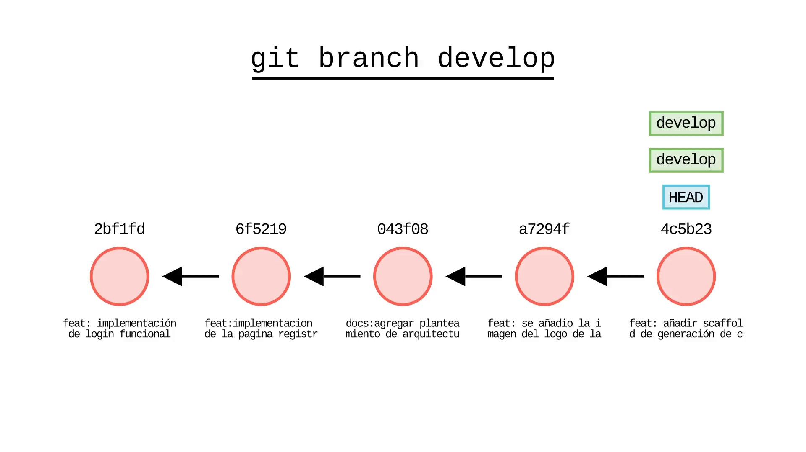
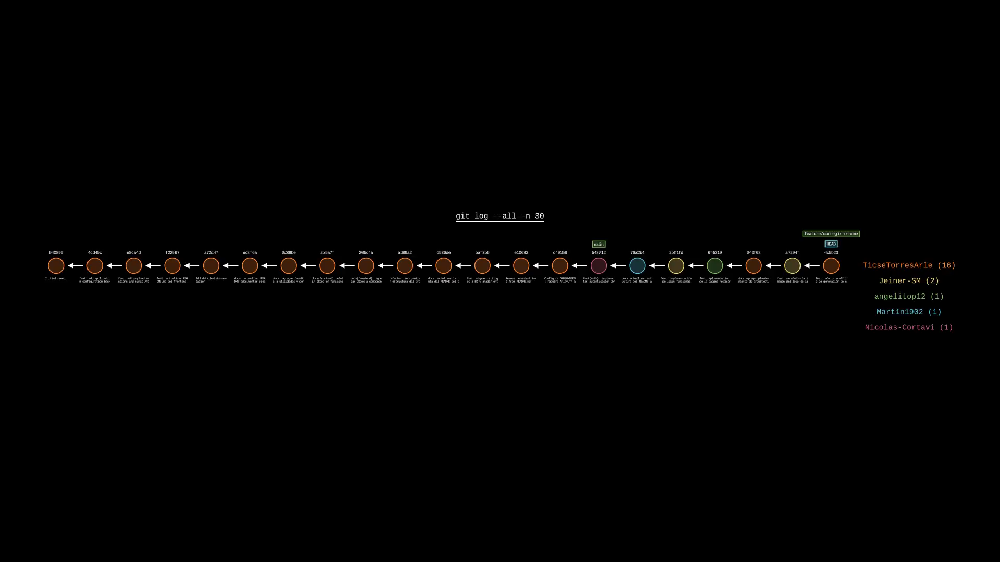
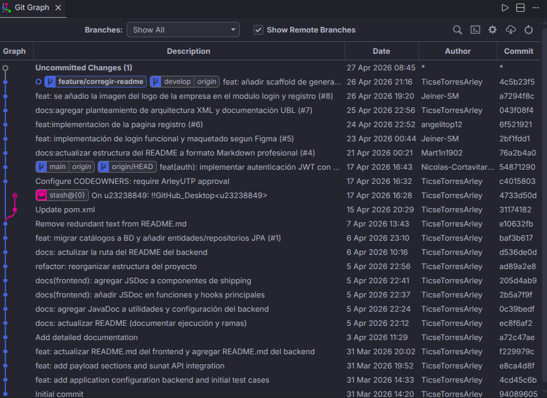

<div align="center">
  

  # AutonomiFlow

  <p><strong>Generación y descarga de tramas TXT y XML UBL 2.1 para comprobantes electrónicos.</strong></p>

  [](https://www.oracle.com/java/)
  [](https://spring.io/projects/spring-boot)
  [](https://react.dev/)
  [](https://www.typescriptlang.org/)
</div>

Repositorio full-stack compuesto por una API REST en Java Spring Boot (`src/backend/api`) y una aplicación web en React + TypeScript (`src/frontEnd`).

---

## 📌 Tecnologías usadas

| Capa | Stack |
|------|-------|
| Backend | Java 21, Spring Boot 4.x (Web MVC, Validation), Maven (wrapper), springdoc-openapi (Swagger), JUnit |
| Frontend | Node.js v20+, npm, React 18 + TypeScript, Vite, React Router, React Hook Form, Axios, Tailwind CSS, Radix UI, TanStack React Query |

---

## 🌿 Ramas

Flujo recomendado para desarrollo, integración y correcciones urgentes.

| Rama | Descripción |
|------|-------------|
| `main` | Producción estable. Solo merges desde `develop` o `hotfix/*` aprobados. |
| `develop` | Integración para la próxima versión. |
| `feature/<nombre>` | Nuevas funcionalidades (derivan de `develop`). |
| `hotfix/<nombre>` | Correcciones urgentes (derivan de `main`, luego merge a `main` y `develop`). |

> Ejemplos: `feature/emitir-trama`, `hotfix/fix-encoding-txt`

---

## 📂 Evidencias

Ubicaciones de evidencias:
- Carpeta base del proyecto: [`/docs/evidencias`](./docs/evidencias)
- Imágenes de flujo Git: [`/git-sim_media/Imagenes`](./git-sim_media/Imagenes)
- Video de flujo Git: [`/git-sim_media/Videos`](./git-sim_media/Videos)

### Capturas





### Video

<video src="./git-sim_media/Videos/flujo-git.mp4" controls width="100%">
	Tu navegador no soporta la etiqueta de video.
</video>

Enlace directo: [Ver flujo-git.mp4](./git-sim_media/Videos/flujo-git.mp4)

---

## ✅ Funcionalidades actuales

Se mantiene el checklist para el seguimiento funcional.

- [ ] Generación de tramas TXT para comprobantes electrónicos
- [ ] Descarga de tramas generadas
- [ ] Login
---

## 🚀 Ejecución local

Se recomienda iniciar primero el backend y luego el frontend.

### 1) Backend

**Requisito:** JDK 21

```bash
cd src/backend/api
./mvnw spring-boot:run
```

La API queda disponible en `http://localhost:8080/api/v1`.

| Herramienta | URL |
|-------------|-----|
| Swagger UI | `http://localhost:8080/swagger-ui` |
| OpenAPI Docs | `http://localhost:8080/api-docs` |

### 2) Frontend

**Requisito:** Node.js v20+ y npm

```bash
cd src/frontEnd
npm install
npm run dev
```

**Variable de entorno requerida:**

```env
VITE_API_BASE_URL=http://localhost:8080/api/v1
```

---

## ⚙️ Requisitos previos

- JDK 21
- Node.js v20+
- npm
- Variables de entorno configuradas
